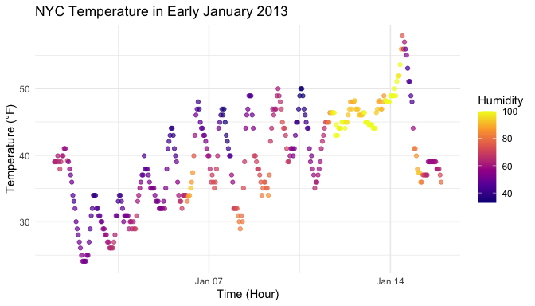

p8105_hw1_vy2196
================

### Problem 1

#### Data description

The `early_january_weather` dataset contains 358 rows and 15 columns.

It includes hourly weather observations from New York City in early
January 2013. Key variables include:

- `time_hour`: the date-time of observation  
- `temp`: temperature in Fahrenheit  
- `humid`: relative humidity (0–100)  
- `wind_dir`: wind direction
- `wind_speed`: wind speed in mph  
- `visib`: visibility in miles  
- plus other variables describing conditions such as `pressure`and
  `origin`.

The mean temperature during this period was 39.6 °F.

#### Creating a scatterplot

``` r
library(ggplot2)

p <- ggplot(early_january_weather, aes(x = time_hour, y = temp, color = humid)) +
  geom_point(alpha = 0.7) +
  scale_color_viridis_c(option = "plasma") +
  labs(title = "NYC Temperature in Early January 2013",
       x = "Time (Hour)",
       y = "Temperature (°F)",
       color = "Humidity") +
  theme_minimal()

# Show in knitted report
p
```

<!-- -->

``` r
# Exporting scatterplot
ggsave("scatterplot_temp_vs_time.png", plot = p, width = 7, height = 4)
```

##### Descriptions of the graph’s pattern

The scatter plot shows a gradual increase in temperature over the next
two weeks starting from January 1st. There was a big temperature
difference in the beginning of January and then it slowly decreased and
increased by mid-January. The humidity also increased comparing to early
January from 40s to approaching 100 toward mid-January.

### Problem 2

``` r
set.seed(123)  # for reproducibility
num_var <- rnorm(10)
log_var <- num_var > 0
char_var <- c("a","b","c","d","e","f","g","h","i","j")
fact_var <- factor(rep(c("low", "medium", "high"), length.out = 10))
df <- data.frame(num_var, log_var, char_var, fact_var)
df
```

    ##        num_var log_var char_var fact_var
    ## 1  -0.56047565   FALSE        a      low
    ## 2  -0.23017749   FALSE        b   medium
    ## 3   1.55870831    TRUE        c     high
    ## 4   0.07050839    TRUE        d      low
    ## 5   0.12928774    TRUE        e   medium
    ## 6   1.71506499    TRUE        f     high
    ## 7   0.46091621    TRUE        g      low
    ## 8  -1.26506123   FALSE        h   medium
    ## 9  -0.68685285   FALSE        i     high
    ## 10 -0.44566197   FALSE        j      low
